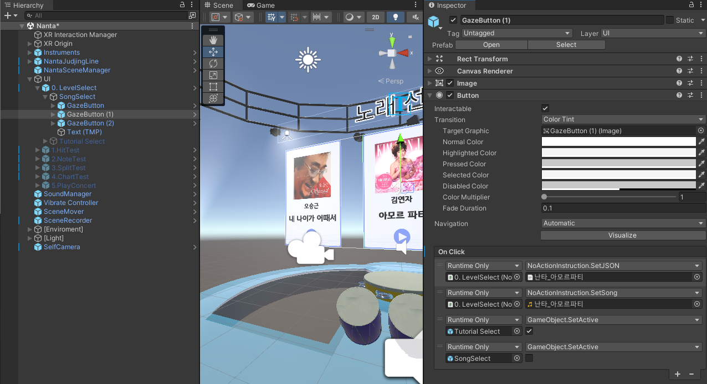
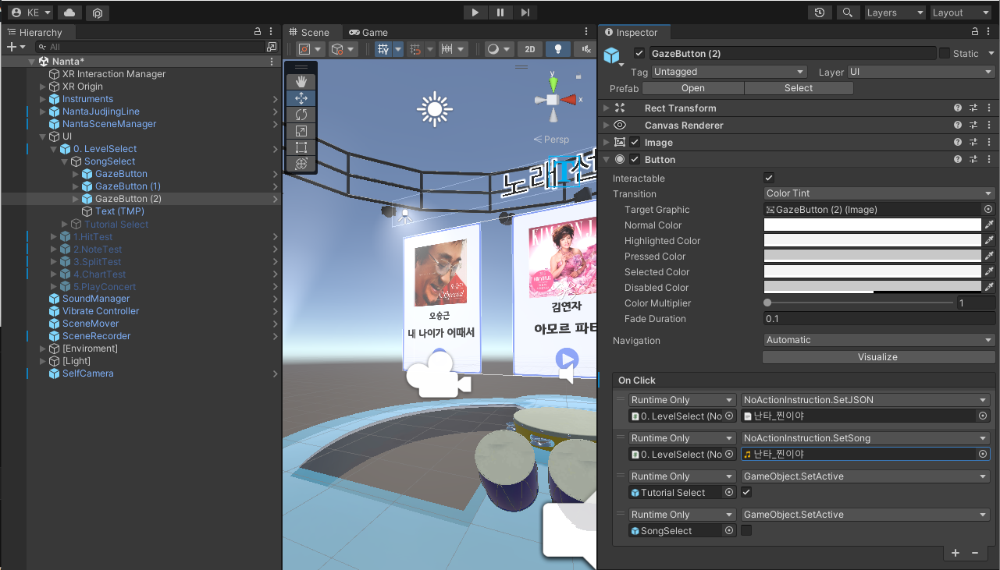
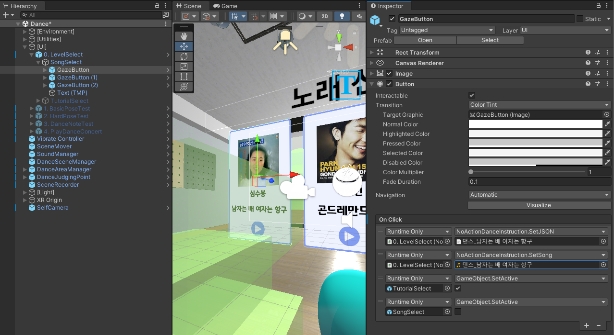
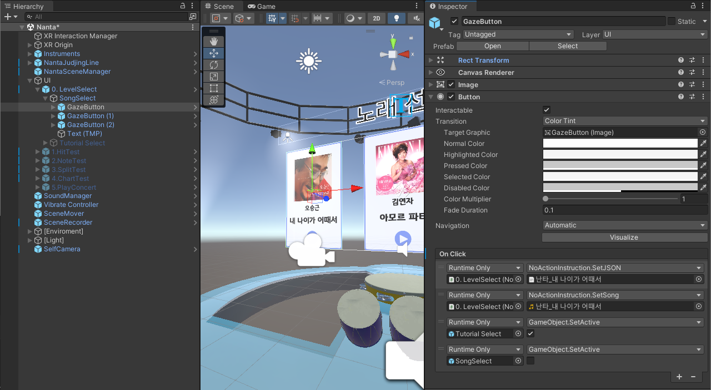

# 개요
### TimmyRoom Repository

Timmy Room의 가상현실 및 증강현실 프로그래밍 프로젝트의 주제는 “노인을 위한 VR 음악센터”입니다. 해당 프로젝트는 오큘러스 퀘스트 기기를 통해 악기 연주나 댄스 강의 및 체험을 VR 콘텐츠로 제공합니다. 이를 통해 시간 및 장소의 제약 없이 노인들의 문화 활동 참여를 늘리고, 음악 감상 및 연주 경험 제공을 통해 노인의 정서적 건강 증진에 기여하는 것을 목표로 합니다.

현재 대한민국의 노인 인구는 매년 증가하고 있습니다. 노인 인구의 증가만큼 정신 건강 증진에 대한 관심도 증가하고 있으며, 이러한 활동 중 많은 인기를 얻는 것이 문화 센터나 강사 초빙을 통한 문화 활동의 참여입니다. 그러나 현실 공간의 문화 센터는 위치가 자택과 멀거나 지방일수록 충분한 시설이 부재하다는 점에서 시공간적 제약이 존재합니다. 이에, 팀 TimmyRoom은 노인들이 오큘러스 퀘스트 기기를 통해 가상 공간에서 이러한 제약 없이 문화 활동을 체험할 수 있는 가상 공간을 만들고자 했습니다. 이러한 문화 활동 중 음악 활동이 노인의 정신 건강에 긍정적 영향을 준다는 점을 근거로 노인을 위한 VR 음악센터를 프로젝트 주제로 선정하였습니다.

해당 프로젝트의 목표는 세 가지입니다. 첫째, 시간 및 장소의 제약 없이 음악 활동 참여가 가능한 공간의 구현입니다. 둘째, 노인에게 맞춰진 인터렉션과 가상 공간 구현 및 제공입니다. 셋째, 노인들의 음악 활동 참여 증진을 통한 정신적, 정서적 건강 증진입니다.

### Team
- [강은호](https://github.com/EunhoKang)
- [박상민](https://github.com/MultiDCP)
- [천현석](https://github.com/hahaho0606)
- [황다빈](https://github.com/Rehean)
- [최준형](https://github.com/Junhyung-Choi)

# How to Build
1. Clone this Repository
2. Open Project with `Unity 21.3.21f1`
3. Add Licensed Files at `Assets/08. Licensed Assets` as follows
  
  
  
  
  
  
  ** if you need a licensed project file, contact us.  zay0njugin@gmail.com
4. Follow the below steps

- Windows:
  
  `File` - `Build Settings` - `Windows, Mac, Linux` - `Build`
  
- Oculus:
   
  `File` - `Build Settings` - `Android` - `Build`

# 각 서류 링크
- [요구사항 명세서](https://github.com/TimmyRoom/TimmyRoom/blob/67c1258f5bd85e3fe2bd8561402a884067ad07b3/Documents/VR%20%EC%9D%8C%EC%95%85%EC%84%BC%ED%84%B0%20%EC%9A%94%EA%B5%AC%EC%82%AC%ED%95%AD%20%EB%AA%85%EC%84%B8%EC%84%9C.pdf)
- [API 문서](https://github.com/TimmyRoom/TimmyRoom/blob/develop/Documents/API/API%20%EB%AC%B8%EC%84%9C.md)
- [FlowChart](https://github.com/TimmyRoom/TimmyRoom/tree/develop/Documents/FlowChart)

- [Class Diagram](https://github.com/TimmyRoom/TimmyRoom/blob/67c1258f5bd85e3fe2bd8561402a884067ad07b3/Documents/Diagram/ClassDiagram.drawio.png)

# 개발 계획
- [개발 계획](https://github.com/orgs/TimmyRoom/projects/1)

# 컨트리뷰션 룰
- [Contribution / Convention](https://github.com/TimmyRoom/TimmyRoom/blob/67c1258f5bd85e3fe2bd8561402a884067ad07b3/Convention.md)
